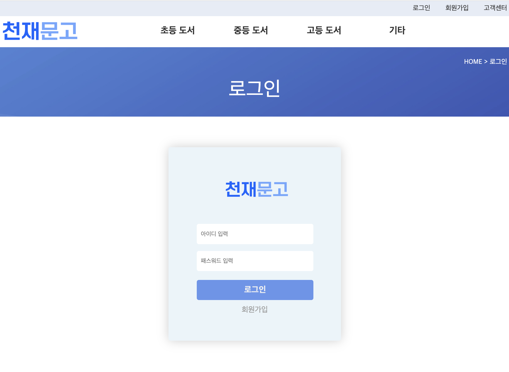

# &nbsp;&nbsp;&nbsp;&nbsp;&nbsp;&nbsp;&nbsp;&nbsp;&nbsp;&nbsp;&nbsp;&nbsp;&nbsp;&nbsp;&nbsp;&nbsp;&nbsp;&nbsp;&nbsp;&nbsp;&nbsp;&nbsp;&nbsp;&nbsp;&nbsp;&nbsp;천재교육 풀스택 과정 4차 프로젝트 
 

&nbsp;&nbsp;&nbsp;&nbsp;&nbsp;&nbsp;&nbsp;&nbsp;&nbsp;&nbsp;&nbsp;&nbsp;&nbsp;&nbsp;&nbsp;&nbsp;&nbsp;&nbsp;&nbsp;&nbsp;&nbsp;&nbsp;&nbsp;&nbsp;&nbsp;&nbsp;&nbsp;&nbsp;&nbsp;&nbsp;&nbsp;&nbsp;&nbsp;&nbsp;&nbsp;&nbsp;&nbsp;&nbsp;&nbsp;&nbsp;&nbsp;&nbsp;&nbsp;&nbsp;&nbsp;&nbsp;&nbsp;&nbsp;&nbsp;&nbsp;&nbsp;&nbsp;&nbsp;&nbsp;&nbsp;&nbsp;&nbsp;&nbsp;&nbsp;&nbsp;
​
  
​
# 📂 프로젝트 소개 
​
안녕하세요!  
**Haebeop**은 학생들을 위한 온라인 강의 플랫폼으로, 
교육에 관한 정보를 공유하고 상호 지원하는 공간을 제공합니다.  
​  
​
 
​
# 🗓 개발일정
2023.10.10 - 2023.10.25
​
 
​
#  🔨 개발스택

### 주요언어
     
 
​
​
​
​
### 개발환경
  

    
​
 
​

### ERD

### USECASE
​

### 구현
- 메인화면
  
- 회원가입 

- 로그인

- 로그인 전

- 로그인 후

- 상품구매

- 마이페이지

- 내정보 수정

- 마이페이지 결제목록

- 마이페이지 결제목록

- 배송조회

- 상품 목록

- 상품 상세

- 상품 추가(관리자)

- 상품 정보 수정(관리자)

- 출고처리(관리자)

- 배송상태변경(관리자)

- 공지 목록

- 공지 글 상세

- 공지 작성(관리자)

- 공지 수정(관리자)
